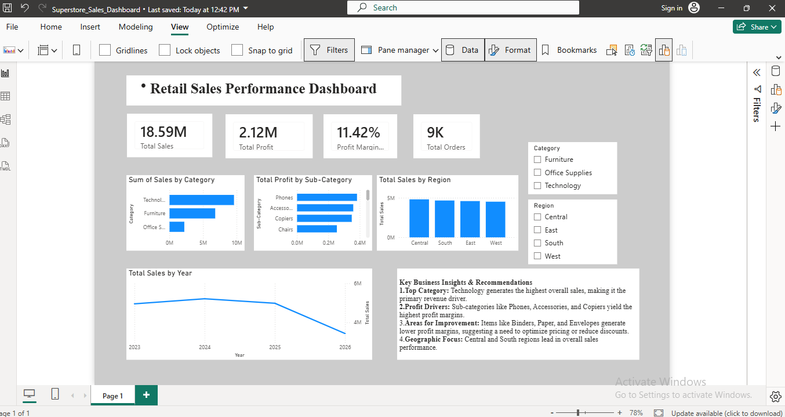

# Retail Sales Performance Dashboard (Power BI)

## 📌 Project Overview
This Power BI dashboard analyzes retail sales data for Sample Superstore to evaluate business performance, identify top-performing categories, and optimize sales strategies across regions.

## 📊 Visual Preview

## 🛠️ Tech Stack & Tools
* **BI Tool:** Power BI Desktop
* **Data Source:** Sample_Superstore.csv
* **Concepts Used:** Power Query, Data Modeling, DAX Measures, Custom Visualizations

## 📈 Key KPIs
* **Total Sales:** $18.59M
* **Total Profit:** $2.12M
* **Profit Margin:** 11.42%
* **Total Orders:** 9K

## 💡 Key Business Insights & Recommendations
1. **Top Category:** Technology leads overall sales volume and serves as the primary revenue driver.
2. **Profit Drivers:** Sub-categories such as Phones, Accessories, and Copiers yield the highest profit margins.
3. **Optimization:** Reduce discount percentages on low-margin sub-categories like Binders, Paper, and Envelopes to boost profitability.
4. **Geographic Focus:** Central and South regions generate strong revenue; targeted marketing here can yield higher growth.# PowerBI-Superstore-Sales-Dashboard
Interactive Power BI dashboard analyzing retail sales, profit margins, and regional performance.
